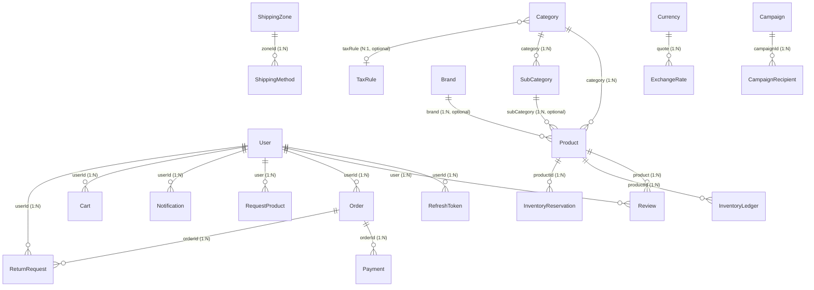
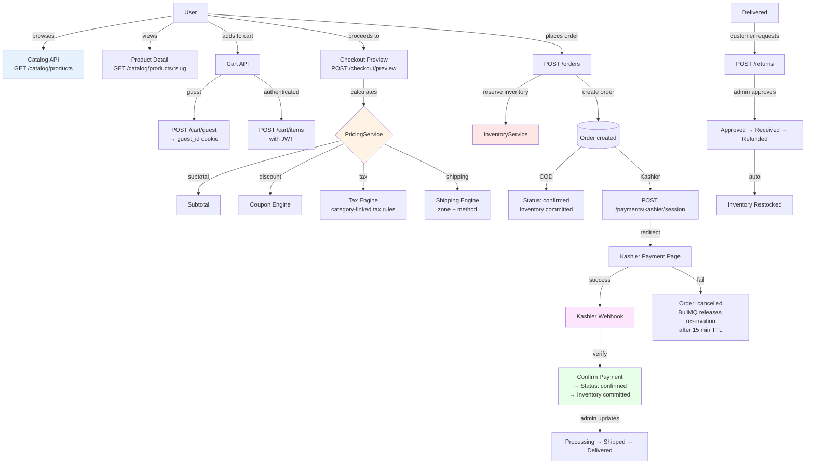
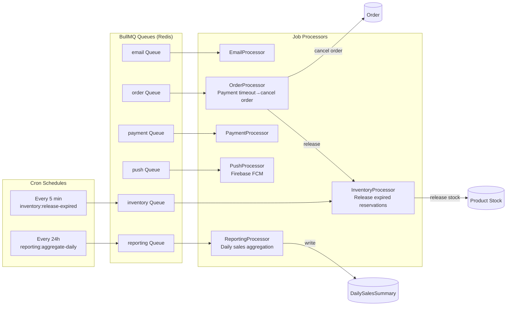
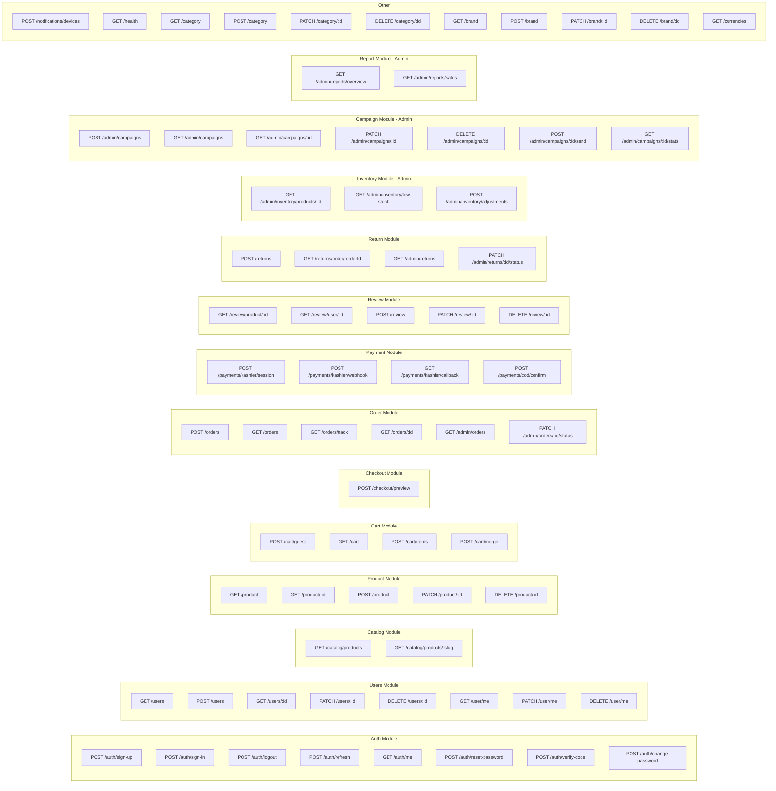
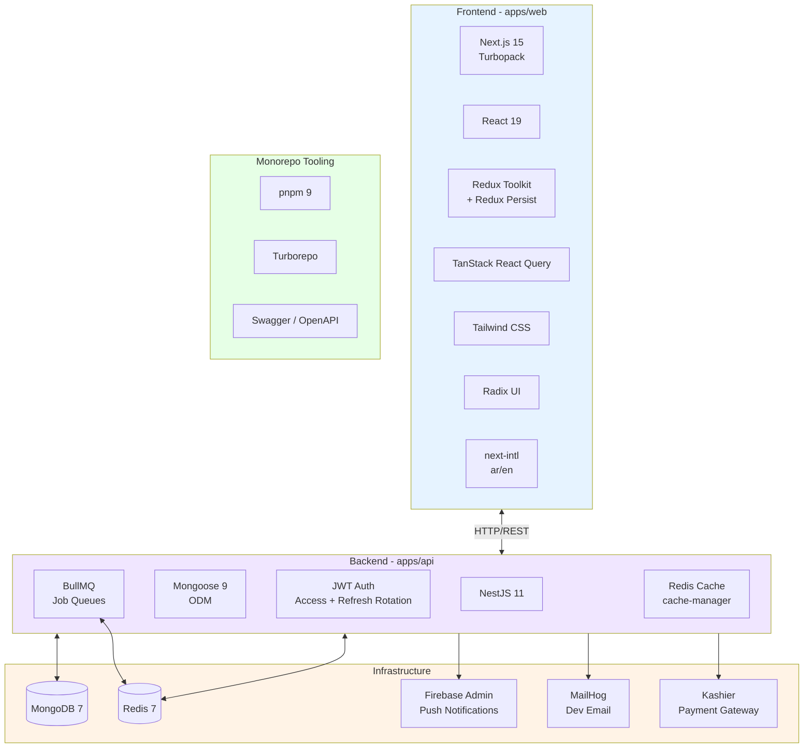

# E-Commerce Application Architecture

## Entity Relationship Diagram

```mermaid
erDiagram
    %% ========================
    %% USER & AUTH DOMAIN
    %% ========================
    User {
        ObjectId _id PK
        string name
        string email UK
        string password
        enum   role "customer | admin | support | marketing | inventory"
        string avatar
        string phoneNumber
        string address
        array  addresses "UserAddress[] embedded"
        object preferences "UserPreferences embedded"
        array  fcmTokens "FcmToken[] embedded"
        boolean active
        string verificationCode
        date   passwordResetVerifiedAt
        enum   gender "male | female"
    }

    RefreshToken {
        ObjectId _id PK
        ObjectId userId FK
        string tokenHash UK
        date   expiresAt TTL
        boolean revoked
    }

    %% ========================
    %% CATALOG DOMAIN
    %% ========================
    Category {
        ObjectId _id PK
        string name UK
        string image
        ObjectId taxRule FK "optional"
    }

    SubCategory {
        ObjectId _id PK
        string name UK
        ObjectId category FK
    }

    Brand {
        ObjectId _id PK
        string name UK
        string image
    }

    Product {
        ObjectId _id PK
        string title UK
        string slug UK
        string description
        map    translations "Record<locale, {title, description}>"
        number quantity
        string imageCover
        array  images
        number sold
        number price
        number priceAfterDiscount "optional"
        array  colors
        array  variants "ProductVariant[] embedded"
        string sku
        boolean trackInventory
        number lowStockThreshold
        string baseCurrency
        boolean isActive
        ObjectId category FK
        ObjectId subCategory FK "optional"
        ObjectId brand FK "optional"
        number ratingsAverage
        number ratingsQuantity
    }

    InventoryLedger {
        ObjectId _id PK
        ObjectId productId FK
        string variantSku "optional"
        number delta "can be negative"
        string reason
        string referenceType "sale | adjustment | return"
        string referenceId
        number balanceAfter
    }

    InventoryReservation {
        ObjectId _id PK
        string reservationId UK
        ObjectId productId FK
        string variantSku "optional"
        number quantity
        string cartId "optional"
        string orderId "optional"
        date   expiresAt TTL
        enum   status "active | committed | released"
    }

    %% ========================
    %% REVIEW DOMAIN
    %% ========================
    Review {
        ObjectId _id PK
        ObjectId product FK
        ObjectId user FK
        number rating "1-5"
        string comment
        boolean isActive
    }

    %% ========================
    %% CART DOMAIN
    %% ========================
    Cart {
        ObjectId _id PK
        string cartId UK "UUID"
        string userId "optional, for auth users"
        string guestId "optional, for guests"
        array  items "CartItem[] embedded"
        string currency
        string locale
        date   expiresAt "30-day TTL for guest carts"
    }

    %% ========================
    %% ORDER DOMAIN
    %% ========================
    Order {
        ObjectId _id PK
        string orderNumber UK "EG-YYYY-XXXXXX"
        ObjectId userId FK "optional"
        string guestEmail "optional"
        string guestPhone "optional"
        enum   status "pending_payment | confirmed | processing | shipped | delivered | return_requested | refunded | cancelled"
        array  items "OrderLineItem[] embedded"
        object pricing "OrderPricing embedded"
        object shippingAddress "Address embedded"
        object billingAddress "Address embedded, optional"
        enum   paymentMethod "cod | kashier"
        enum   paymentStatus "pending | paid | failed | refunded | partial_refund"
        object shipping "{zoneId, methodId, cost, estimatedDelivery}"
        string couponCode "optional"
        string notes "optional"
        array  timeline "OrderTimelineEntry[] embedded"
        string idempotencyKey
    }

    Payment {
        ObjectId _id PK
        ObjectId orderId FK
        string provider "kashier | cod"
        string providerRef "optional"
        number amount
        string currency
        enum   status "pending | paid | failed | refunded | partial_refund"
        string idempotencyKey UK "sparse"
        object rawWebhookPayload
        date   paidAt "optional"
    }

    ReturnRequest {
        ObjectId _id PK
        string returnNumber UK "RMA-{timestamp}"
        ObjectId orderId FK
        ObjectId userId FK "optional"
        string guestEmail "optional"
        array  items "ReturnItem[] embedded"
        enum   status "requested | approved | rejected | received | refunded"
        object refund "{amount, method, providerRef}"
    }

    %% ========================
    %% SHIPPING & TAX DOMAIN
    %% ========================
    ShippingZone {
        ObjectId _id PK
        string name
        array  countries
        boolean isActive
    }

    ShippingMethod {
        ObjectId _id PK
        ObjectId zoneId FK
        string name
        enum   type "flat | weight_based | free_over_threshold"
        object rules "{minOrder, maxWeight, rate, freeShippingThreshold, cities}"
        number estimatedDaysMin
        number estimatedDaysMax
        boolean isActive
    }

    TaxRule {
        ObjectId _id PK
        string name
        enum   taxClass "standard | exempt" UK
        number rate "0-100"
        boolean appliesToShipping
        boolean isActive
    }

    %% ========================
    %% PRICING & COUPONS
    %% ========================
    Coupon {
        ObjectId _id PK
        string name UK
        date   expiryDate
        number discount "0-100 percentage"
    }

    Currency {
        ObjectId _id PK
        string code UK "EGP, USD, EUR"
        string symbol
        number decimals
        boolean isDefault
        boolean isActive
    }

    ExchangeRate {
        ObjectId _id PK
        string base "EGP"
        string quote FK
        number rate
        string source "manual"
        date   effectiveAt
    }

    %% ========================
    %% SUPPLIER & REQUESTS
    %% ========================
    Supplier {
        ObjectId _id PK
        string name UK
        string website
    }

    RequestProduct {
        ObjectId _id PK
        string titleNeed
        string details
        number quantity
        string category "optional"
        ObjectId user FK
    }

    %% ========================
    %% MARKETING
    %% ========================
    Campaign {
        ObjectId _id PK
        string name
        string subject
        string templateId
        object segmentQuery "optional"
        enum   status "draft | scheduled | sending | sent"
        date   scheduledAt "optional"
        object stats "{sent, opened, clicked, failed}"
    }

    CampaignRecipient {
        ObjectId _id PK
        string campaignId
        string email
        string userId "optional"
        string status "pending"
        date   sentAt "optional"
        date   openedAt "optional"
    }

    Notification {
        ObjectId _id PK
        ObjectId userId FK "optional"
        string guestId "optional"
        enum   channel "email | push"
        string template
        object payload
        string status "pending"
        date   sentAt "optional"
    }

    %% ========================
    %% REPORTING
    %% ========================
    DailySalesSummary {
        ObjectId _id PK
        string date
        string country "EG"
        string currency "EGP"
        number ordersCount
        number grossRevenue
        number netRevenue
        number refunds
        number avgOrderValue
    }
```

## Model Relationships (Foreign Keys & References)



## Core Shopping Flow



## Admin Operations Flow

```mermaid
flowchart TD
    Admin[Admin User] --> Dashboard[Dashboard<br/>Overview Metrics]

    Admin --> ProductMgmt[Product Management]
    ProductMgmt -->|CRUD| ProductAPI[POST/PATCH/DELETE /product]
    ProductMgmt -->|Categories| CatAPI[POST/PATCH/DELETE /category]
    ProductMgmt -->|Brands| BrandAPI[POST/PATCH/DELETE /brand]

    Admin --> OrderMgmt[Order Management]
    OrderMgmt -->|list/filter| ListOrders[GET /admin/orders]
    OrderMgmt -->|update status| UpdateStatus[PATCH /admin/orders/:id/status]
    UpdateStatus --> Timeline[Status Flow:<br/>confirmed→processing→shipped→delivered]

    Admin --> InventoryMgmt[Inventory Management]
    InventoryMgmt -->|view stock| Stock[GET /admin/inventory/products/:id]
    InventoryMgmt -->|low stock alerts| LowStock[GET /admin/inventory/low-stock]
    InventoryMgmt -->|adjust stock| Adjust[POST /admin/inventory/adjustments<br/>audited in InventoryLedger]

    Admin --> ReturnMgmt[Return Management]
    ReturnMgmt -->|list returns| ListReturns[GET /admin/returns]
    ReturnMgmt -->|approve/reject| ReturnStatus[PATCH /admin/returns/:id/status]
    ReturnStatus -->|refunded| Restock[Auto restock inventory]

    Admin --> TaxMgmt[Tax Management]
    TaxMgmt -->|CRUD tax rules| TaxAPI[POST/PATCH/DELETE /tax]

    Admin --> CampaignMgmt[Campaign Management]
    CampaignMgmt -->|create| CreateCamp[POST /admin/campaigns]
    CampaignMgmt -->|send| SendCamp[POST /admin/campaigns/:id/send]
    SendCamp -->|queues emails| BullMQ[BullMQ → Email Queue]
    CampaignMgmt -->|stats| Stats[GET /admin/campaigns/:id/stats]

    Admin --> Reports[Reports & Analytics]
    Reports -->|overview| Overview[GET /admin/reports/overview]
    Reports -->|sales breakdown| Sales[GET /admin/reports/sales]

    style Admin fill:#ffe6e6
    style ProductMgmt fill:#e6f3ff
    style OrderMgmt fill:#e6ffe6
    style InventoryMgmt fill:#fff3e6
    style Reports fill:#f0e6ff
```



## Background Job Queues (BullMQ)



## Complete API Map



## Technology Stack


